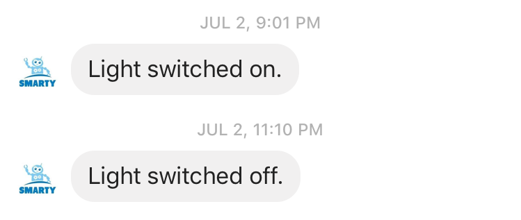
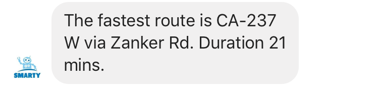
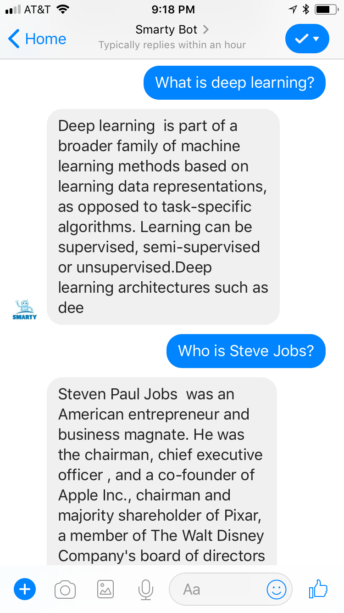
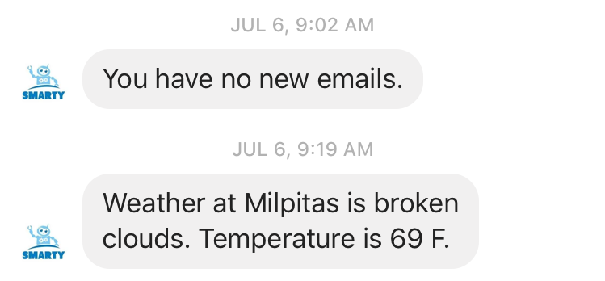

<div class="ui small rounded images">
  
  
  
  
  
  
</div>

### Smart Plug Controller
Raspberry Pi based chatbot to switch on/off plug at a desired time.<br/>
Sometimes, when we go out on a vacation. It's better to have lights automatically switched on at nights so that it gives an impression that there are people inside the home. I have heard stories about theft in neighbourhood. So, I thought this would be a good feature to have. I used TP-Link smart plug for this and connected a lamp to it. I wrote a cron job to switch on the plug at 8pm and switch it off at 11pm. The chatbot sends me a notification when the light is on/off.

I can also issue switch on/off commands to chatbot at any time as I wish.<br/>
<p align='center'></p><br/>

[code](https://github.com/arunn314/smartybot/blob/master/plug_handler.py)  


### Google Maps Directions alert
Raspberry Pi based chatbot to send directions to/from office when leaving to/from office. This is very useful when there are multiple routes to the destination. The bot alerts the fastest route to destination.<br/>
When I leave to office, every morning I need to check Google Maps to see which route is the fastest based on traffic information. So, I set up a daily alert to send me the fastest route to office in the morning and route from office to home in the evening. This feature saves my time to check traffic everyday.

I can also ask chatbot like "What is the fastest route to (destination) ?" and it would respond me with a similar message and duration.
<p align='center'></p><br/>
[code](https://github.com/arunn314/smartybot/blob/master/gmaps_handler.py)

### Ask Wikipedia
Raspberry Pi based chatbot to ask Wikipedia about any person/thing.  
To know about some person/thing quick, I can ask chatbot to get a short summary of it from Wikipedia. I use Wikipedia API to query about the entity I am interested in.
To ask this I can say/type "Who is Steve Jobs ?", "What is Deep Learning ?"<br/>
The image below shows a demo of question and answering from Wikipedia.
<p align='center'></p><br/>
[code](https://github.com/arunn314/smartybot/blob/master/wiki_handler.py)

### Daily Weather updates
Raspberry Pi based chatbot to send daily weather updates to FB Messenger. The user can ask weather at any location in the world.<br/>
There might be heavy rains and it's good to take Umbrella on those days. So, I decided to add a daily weather alert to my chatbot. It will send weather update everyday morning about temperature in my city and weather status like sunny, windy, rains etc.<br/>
I can ask daily weather update about any location in world by just asking "What is the weather in Paris, France?"<br/>
[code](https://github.com/arunn314/smartybot/blob/master/weather_handler.py)

### Daily Gmail Alerts
Chatbot sends daily alert about new emails every morning.<br/>
It would be nice if the chatbot could check my email account and notify if there are any new emails today. My chatbot does this every morning and sends me a notification about any new unread email.<br/>
I can also ask if there are any emails from specific sender.
For example, I can ask "Did I get any email from Fedex?"<br/>
<p align='center'></p><br/>
[code](https://github.com/arunn314/smartybot/blob/master/gmail_handler.py)


### Stock Queries
Ask daily stock value of popular US companies.  
I can ask chatbot to know about stock values of popular US companies.
I can just ask "what is the stock price of Apple ?"<br/>
```python
STOCK_SYMBOLS = {
    'apple': 'AAPL',
    'google': 'GOOG',
    'facebook': 'FB',
    'snap': 'SNAP',
    'amazon': 'AMZN',
    'microsoft': 'MSFT'
}
```
[code](https://github.com/arunn314/smartybot/blob/master/stock_handler.py)
