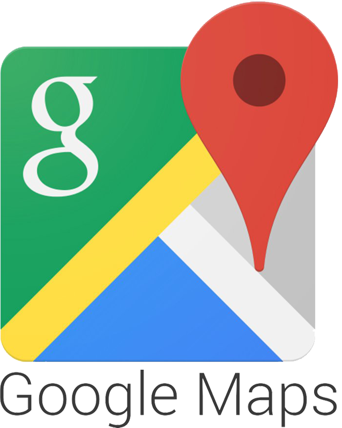

  
  
  
  
  
  

### Smart Plug Controller
Raspberry Pi based chatbot to switch on/off plug at a desired time.

### Daily Weather updates
Raspberry Pi based chatbot to send daily weather updates to FB Messenger. The user can ask weather at any location in the world.

### Google Maps Directions alert
Raspberry Pi based chatbot to send directions to/from office when leaving to/from office. This is very useful when there are multiple routes to the destination. The bot alerts the fastest route to destination.

### Ask Wikipedia
Raspberry Pi based chatbot to ask Wikipedia about any person/thing.

### Daily Gmail Alerts
Chatbot sends daily alert about new emails every morning.

### Stock Queries
Ask daily stock value of popular US companies.
