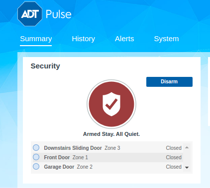

I have ADT home security system installed at my home. The security system needs to arm/disarmed manually everyday when we leave/enter the house. I thought of automating this using the Raspberry Pi Chatbot that I have built. 

I went through the website and thought I would use Selenium to simulate arm/disarm automatically everyday. I decided to set a cronjob to arm every night before sleep and disarm every morning. I used Selenium package to figure out the element names in DOM and wrote a class to arm stay, arm away and disarm. The cronjob calls the appropriate function everyday and the bot sends me notification in FB messenger. This feature has minimized our intervention with security system. It arms/disarms everyday automatically.

I have also added a feature to put the status automatically to arm stay when me and my wife are out of out home. I track the latitude and logitude of our location and if we forget to arm when we leave, it automatically arms the security system and sends us a notification. This feature makes the bot smart to know what to do based on our location. This has been very useful to us. 

[ADT Handler code](https://github.com/arunn314/smartybot/blob/master/adt_handler.py) 
