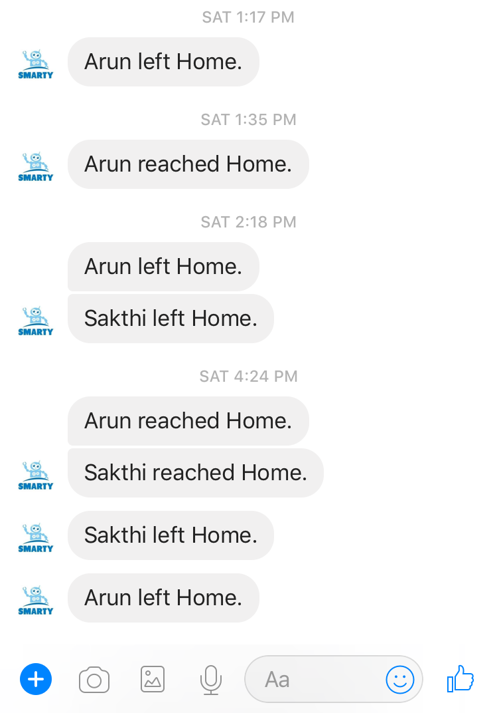

Life 360 app helps to track user's latitude and longitude in near real time. Life 360 app has a Webpage which I parsed using BeautifulSoup. My wife and I installed Life 360 app in our phones and I setup a script to pull the latitude and longitude coordinates every 1 minute.

I also defined landmarks in the code for most visited places like Home, Office etc. The list of landmarks can be extended as needed. Location tracker code tracks the coordinates every one minute and whenever one of us leaves or reaches a landmark, the chatbot sends us alert saying "User reached/left Landmark". The following image shows a screenshot of bot sending notifications.
 

#### Home Security System Automation
I have also included code to detect if both of us are out and arm the home security system automatically. In case, if we have forgot to arm the security system. Also when anyone of us reach home and the security system was in armed state. The chatbot notifies us to disarm the security system.

[Life 360 Handler code](https://github.com/arunn314/smartybot/blob/master/life360_handler.py)
[Location Tracker code](https://github.com/arunn314/smartybot/blob/master/location_server.py)
