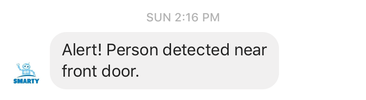
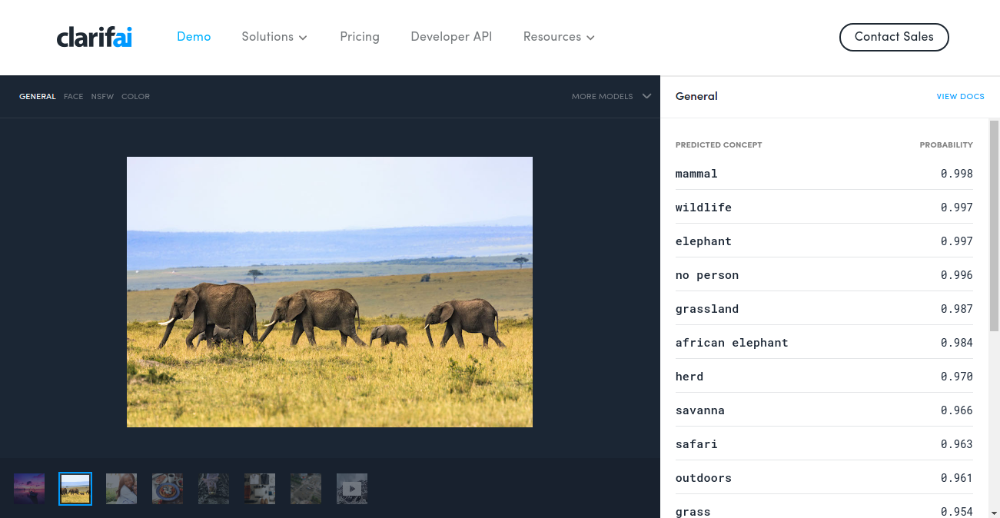
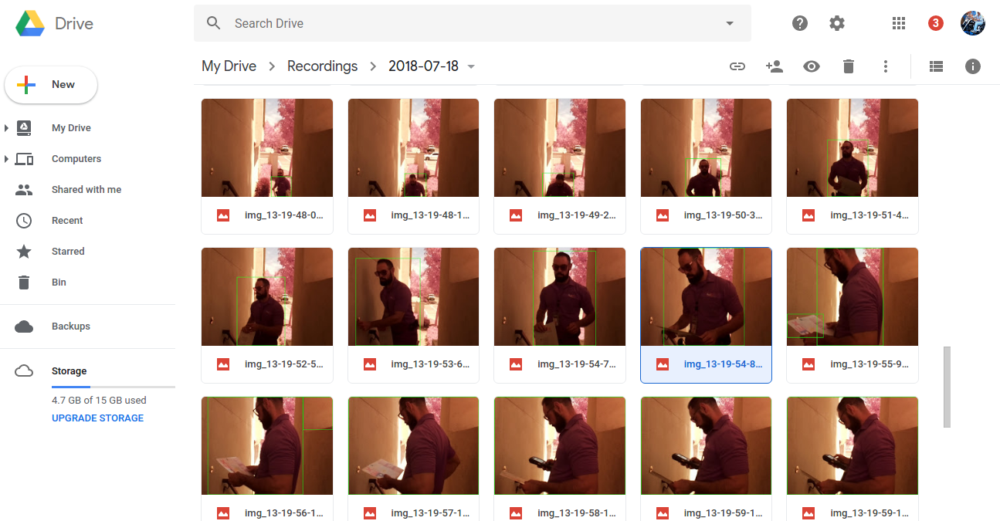

A Raspberry Pi Zero based security camera($50) installed near front door.
Takes picture of motion and uploads to Google Drive.
Send Alerts to FB messenger.

I wanted to have a camera surveilance system for my home but do not want to spend a lot for it. So, I decided to make one myself at a lower cost. I bought a Raspberry pi Zero W with a picamera for $50. I installed it outside my front door with rain protection cover for the power outlet.

The Pi contiuously runs the camera and reads frame by frame. It would be a simpler solution to just record video continously and I can monitor manually if any action happpened. Instead, I wanted the system to be smart enough to detect any motion and alert me when needed. I also needed a place to store images captured. For this, I used Google Drive API to upload the pictures taken everyday. A sample alert message.

 

### Background Subtraction & Contour Detection
Based on the reference below, I built a simple motion detection algorithm based on background subtraction of adjacent frames and contour detection. If the contour size was larger than a certain size, an alert is triggered. This algorithm had several limitations. I started getting false positives when some tree branches infront of my front door moved, when a large truck moved in the opposite road and interestingly, when a car flashed lights during night time, it was detected as a very large contour.

### Deep Learning based Image classification
In order to make the motion detection system more robust, I decided to use some deep learning to detect persons specifically. However, given the limited memory/processor of Raspberry Pi doing image classification on device would be too slow. So, I used Clarifai's image classification API to detect humans in the captured image. The API has 5k free requests per month. The API does a very good job and has reduced false positives almost to zero. 

 

The system detects any motion based on the former algorithm and uploads to Google Drive. Another Raspberry Pi scans all images in the Google Drive and passes it to Clarifai API to detect humans. Once the response arrives, the images without humans are deleted. The following is a screenshot of images uploaded to my Google Drive when a Fedex delivery came to deliver a package. 

 

### References: 
1. [(https://hackernoon.com/raspberrypi-home-surveillance-with-only-150-lines-of-python-code-2701bd0373c9)](https://hackernoon.com/raspberrypi-home-surveillance-with-only-150-lines-of-python-code-2701bd0373c9)
